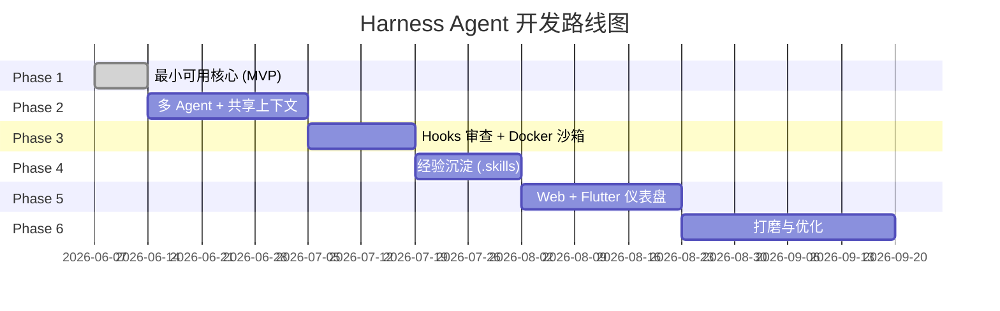
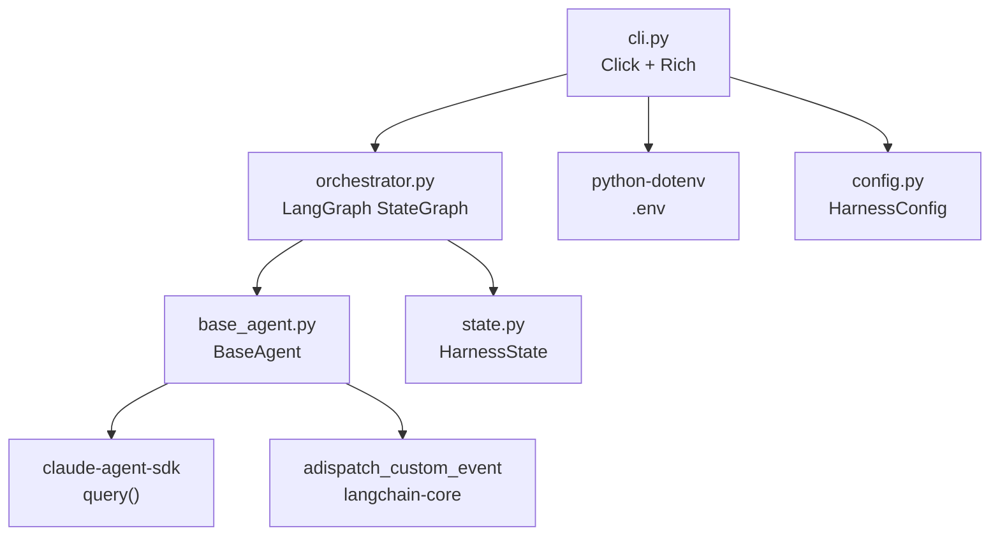

# Harness Agent — 项目架构全景文档

> **版本**: v1.0 | **日期**: 2026-06-07 | **状态**: Phase 1 已完成

---

## 1. 项目定位

**Harness Agent** 是一个基于 `claude-agent-sdk`（Anthropic 官方 Python SDK）的智能开发编排系统，使用 LangGraph 进行 Agent 编排，旨在解决以下核心痛点：

| # | 痛点 | 解决思路 |
|---|------|---------|
| 1 | 多终端上下文隔离 | 共享上下文管理器（Phase 2） |
| 2 | 上下文传递成本高 | LangGraph State + system_prompt 注入 |
| 3 | 缺少代码审查 | Hooks（PreToolUse）自动拦截审查（Phase 3） |
| 4 | 经验无法沉淀 | .skills 知识库自动生成（Phase 4） |

---

## 2. 技术栈

| 层级 | 技术 | 版本/说明 |
|------|------|-----------|
| **Agent 执行引擎** | `claude-agent-sdk` | ≥0.2.90，Anthropic 官方 Python SDK |
| **Agent 编排** | `langgraph` | ≥0.2.0，状态图编排 |
| **状态/消息基础** | `langchain-core` | ≥0.3.0，BaseMessage / adispatch_custom_event |
| **CLI 框架** | `click` | ≥8.1.0，命令行解析 |
| **终端渲染** | `rich` | ≥13.0.0，Rich Console + Panel |
| **环境变量** | `python-dotenv` | ≥1.0.0，加载 .env |
| **异步运行时** | `anyio` | ≥4.0.0 |
| **构建系统** | `hatchling` | pyproject.toml 构建后端 |
| **测试** | `pytest` + `pytest-asyncio` | 异步测试支持 |
| **代码规范** | `ruff` | ≥0.5.0，Python ≥3.10 |

---

## 3. 当前项目结构（Phase 1 完成后）

```
harness-claude-code/
├── src/
│   └── harness_agent/                    # 主包
│       ├── __init__.py                   # 版本号 (0.1.0)
│       ├── cli.py                        # CLI 入口 + 流式渲染层
│       ├── config.py                     # 配置管理 (HarnessConfig)
│       └── core/
│           ├── __init__.py
│           ├── orchestrator.py           # LangGraph 编排引擎
│           ├── state.py                  # HarnessState 状态定义
│           └── agents/
│               ├── __init__.py
│               └── base_agent.py         # Agent 基类（纯函数 + 事件发射）
├── tests/
│   ├── __init__.py
│   ├── test_smoke.py                     # 冒烟测试（SDK 连通 + Caching 探测）
│   └── test_orchestrator.py              # 编排器测试
├── docs/
│   ├── harness_agent_plan.md             # 整体项目规划（6 阶段）
│   ├── phase_1_plan.md                   # Phase 1 详细计划（v3）
│   ├── sdk_bridge_solutions.md           # SDK 方案演变记录
│   ├── 1.md                              # 技术栈备忘
│   └── architecture_overview.md          # 📍 本文档
├── pyproject.toml                        # 项目配置 + 依赖声明
├── .env                                  # 环境变量（API Key 等）
├── .gitignore
└── README.md                             # 安装 & 使用说明
```

---

## 4. 核心架构（Phase 1）

### 4.1 分层数据流

```
用户终端 (CLI)
    │
    │ harness run "重构 user.py"
    │
    ▼
┌─────────────────────────────────────────────┐
│  cli.py — 流式渲染层                          │
│                                              │
│  TerminalRenderer 拦截 astream_events：       │
│    agent_text   → 打印文本                    │
│    agent_tool   → 🛠️ 工具名 + 摘要            │
│    agent_result → ✅/❌ 结果                   │
│    agent_error  → 💥 错误                     │
└──────────────────┬──────────────────────────┘
                   │
                   ▼
┌─────────────────────────────────────────────┐
│  LangGraph StateGraph（极简直线图）            │
│                                              │
│  START ──→ default_agent ──→ END             │
│                                              │
│  ⚠️ State.messages 仅作最终结果归档            │
└──────────────────┬──────────────────────────┘
                   │
                   ▼
┌─────────────────────────────────────────────┐
│  BaseAgent（纯函数，无 IO 副作用）             │
│                                              │
│  1. 调用 query(prompt, options)              │
│  2. 遍历 SDK 返回的 Message                   │
│  3. 分类发射自定义事件 (adispatch_custom_event)│
│  4. 组装归档结果 → 返回 State update           │
└──────────────────┬──────────────────────────┘
                   │
                   ▼
┌─────────────────────────────────────────────┐
│  claude-agent-sdk                            │
│                                              │
│  query(prompt, options) → AsyncIterator      │
│  SDK 内部 ReAct 循环 + 工具执行 + 上下文管理   │
└─────────────────────────────────────────────┘
```

### 4.2 五大设计原则

| # | 原则 | 实现方式 |
|---|------|---------|
| 1 | **流式输出职责分离** | BaseAgent 只发射事件（`adispatch_custom_event`），CLI 层拦截渲染 |
| 2 | **极简状态图** | `START → default_agent → END`，不做过早抽象 |
| 3 | **全类型事件可见** | 捕获 TextBlock / ToolUseBlock，分类发射 4 种事件 |
| 4 | **明确"脑裂"** | LangGraph State ≠ SDK 内部状态，State 仅归档 |
| 5 | **异常安全** | BaseAgent 内 try-except 包裹 SDK 调用，错误也通过事件发射 |

---

## 5. 模块详解

### 5.1 `cli.py` — 流式渲染层

| 职责 | 说明 |
|------|------|
| 加载环境变量 | `load_dotenv()` 加载 .env 中的 ANTHROPIC_API_KEY |
| 命令解析 | Click group：`harness run <prompt>` / `harness version` |
| 事件渲染 | `TerminalRenderer` 类消费 `astream_events`，按类型渲染 |
| 异步桥接 | `asyncio.run()` 将异步流式渲染循环跑在同步 CLI 入口中 |

**事件渲染规则：**

| 事件名 | 渲染效果 |
|--------|---------|
| `agent_text` | 直接打印文本（流式追加） |
| `agent_tool` | `🛠️ [N] 工具名 摘要输入` |
| `agent_result` | `✅ 完成` 或 `❌ 失败: 内容` |
| `agent_error` | `💥 错误: 详情` |

### 5.2 `config.py` — 配置管理

`HarnessConfig` dataclass，包含：
- `project_dir`: 项目工作目录（自动 resolve 为绝对路径）
- `max_turns`: Agent 最大交互轮次（默认 15）
- `allowed_tools`: 允许的工具列表（默认 Read/Write/Edit/Bash）
- `log_level`: 日志级别（默认 INFO）

### 5.3 `state.py` — LangGraph 状态

```python
class HarnessState(TypedDict):
    messages: Annotated[list[BaseMessage], add_messages]  # 归档记录
    task: str           # 用户原始任务描述
    project_dir: str    # 项目工作目录
```

**关键设计决策 —"脑裂"：**
- `messages` 仅作为 Agent 执行结果的归档
- Agent 内部的 ReAct 循环由 `claude-agent-sdk` 内部状态机闭环管理
- LangGraph State 和 SDK 内部状态是两个独立的世界
- Phase 2 计划通过「摘要注入 prompt」来桥接

### 5.4 `orchestrator.py` — 编排引擎

- `build_graph()`: 构建极简直线图 `START → default_agent → END`
- `HarnessOrchestrator`:
  - `run(task)`: 同步执行（`ainvoke`），用于测试
  - `stream(task)`: 流式执行（`astream_events v2`），供 CLI 消费

### 5.5 `base_agent.py` — Agent 基类

**核心流程：**

1. 从 `HarnessState` 中提取 `task` 和 `project_dir`
2. 构建 `ClaudeAgentOptions`（system_prompt / cwd / allowed_tools / max_turns / permission_mode）
3. 调用 `query(prompt, options)` 获取 SDK 消息流
4. 按消息类型分类处理：
   - `AssistantMessage` → `TextBlock` / `ToolUseBlock`
   - `ResultMessage` → 成功结果或错误
5. 通过 `adispatch_custom_event()` 发射事件
6. 组装 `AIMessage` 归档结果返回

**辅助函数：**
- `_summarize_tool_input()`: 将工具输入摘要化（command / file_path / content 长度），防止日志爆炸

---

## 6. Phase 1 验收状态

| # | 验收项 | 状态 |
|---|--------|------|
| 1 | SDK 连通 | ✅ 冒烟测试覆盖 |
| 2 | Caching 验证 | ✅ 探测性测试已实现 |
| 3 | 编排正确 | ✅ 直线图 START→Agent→END |
| 4 | 文本可见 | ✅ CLI 实时显示 agent_text |
| 5 | 工具可见 | ✅ CLI 实时显示 agent_tool |
| 6 | 结果可见 | ✅ CLI 显示 ✅/❌ 状态 |
| 7 | 纯函数 | ✅ BaseAgent 无 print() |
| 8 | 无 Router | ✅ 状态图只有 1 个节点 |

---

## 7. 测试覆盖

### `test_smoke.py`（7 个测试）

| 测试 | 类型 | 说明 |
|------|------|------|
| `test_sdk_import` | 单元 | SDK 核心类型可导入 |
| `test_sdk_simple_query` | 集成 | SDK 端到端简单查询 |
| `test_sdk_message_types` | 探测 | 打印实际 Message/Block 类型名 |
| `test_prompt_caching_support` | 探测 | Prompt Caching 是否生效 |
| `test_package_import` | 单元 | harness_agent 包可导入 |
| `test_config_import` | 单元 | HarnessConfig 正确初始化 |
| `test_state_import` | 单元 | HarnessState 是 dict 子类 |

### `test_orchestrator.py`（1 个测试）

| 测试 | 类型 | 说明 |
|------|------|------|
| `test_graph_compiles` | 单元 | 状态图可正确编译 |

---

## 8. 整体路线图



| Phase | 目标 | 关键特性 |
|-------|------|---------|
| **Phase 1** ✅ | MVP 数据管道 | SDK 连通 → LangGraph → CLI 流式渲染 |
| **Phase 2** | 多 Agent 协作 | SharedContext 三层上下文、Router 意图分发、Frontend/API/Backend Agent |
| **Phase 3** | 代码质量保障 | PreToolUse Hooks 代码审查、Docker 沙箱验证、MCP 自定义工具 |
| **Phase 4** | 经验沉淀 | PostToolUse 错误捕获、SkillsAgent 分析生成、.skills 知识库注入 |
| **Phase 5** | 可视化前端 | FastAPI + WebSocket、React Web 仪表盘、Flutter 跨端客户端 |
| **Phase 6** | 持续优化 | 向量检索、自适应策略、性能并行化 |

---

## 9. 关键依赖关系



---

## 10. 环境配置

### 安装

```bash
python -m venv .venv
.\.venv\Scripts\activate        # Windows
pip install -e ".[dev]"
```

### 环境变量（`.env`）

```
ANTHROPIC_API_KEY=sk-ant-xxxxx
HARNESS_PROJECT_DIR=.
HARNESS_LOG_LEVEL=INFO
```

### CLI 命令

```bash
harness --version                         # 查看版本
harness run "创建一个 hello_world.py"      # 执行任务
harness run "重构 user.py" -p ./my-app     # 指定项目目录
```

---

## 11. Phase 2 前瞻：需要新增的模块

基于整体规划，Phase 2 需要：

| 新模块 | 说明 |
|--------|------|
| `core/context.py` | SharedContext 三层上下文管理器（全局/领域/任务） |
| `core/agents/frontend_agent.py` | 前端 UI 开发专家 |
| `core/agents/api_agent.py` | 前后端接口联调专家 |
| `core/agents/backend_agent.py` | 后端业务开发专家 |
| `orchestrator.py` 重构 | 添加 Router 条件路由节点 |
| `state.py` 扩展 | 增加 shared_context / current_agent 等字段 |
